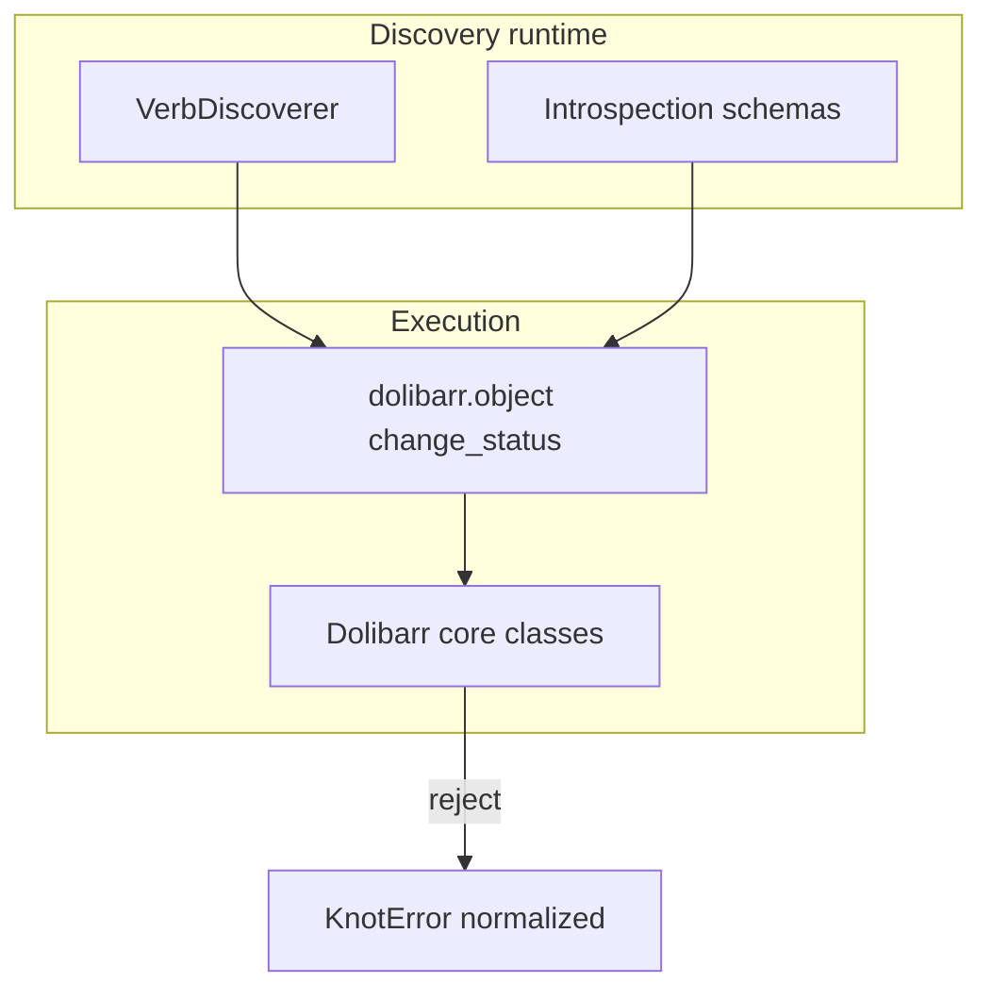

# State machine (design — hybrid model)

Formal design for workflow-aware **status transitions** on Dolibarr objects, aligned with **ADR-005** (hybrid analysis). No exhaustive static graph is assumed before runtime.

## Goals

- Represent Dolibarr object lifecycles relevant to Knot (`change_status`, guards, validation side-effects).
- Stay compatible with introspection-driven connectors and **partial** transition knowledge per Dolibarr version / optional modules.
- Surface **actionable** diagnostics using structured Knot errors when Dolibarr rejects a transition.

## Non-goals (current milestone)

- Shipping a standalone `StateMachineEngine` that replaces Dolibarr as authority.
- Guaranteeing that every invalid transition is blocked **before** runtime across all modules.

## Model overview

### Levels (conceptual)

| Level | Meaning | Knot today |
|-------|---------|------------|
| **L1 — Constants** | Known status codes (`Facture::STATUS_DRAFT`, …) | Surfaced via introspection where available |
| **L2 — Candidate verbs** | Methods that may change status (`validate`, `setPaid`, …) | `VerbDiscoverer` + simulation hooks |
| **L3 — Guards** | Preconditions (permissions, mandatory lines, stock…) | Partial — relies on Dolibarr exceptions + translators |

## Integration points

- **Connector** `dolibarr.object` reads/writes status fields using resolved operations.
- **Inspector** shows verb lists and risk hints (see `docs/ux/risk-grammar.md`).
- **Canvas (editor)** — For **`change_status`** on pilot slugs only, lazy-evaluated hints mirror inspector semantics (`simulateError`, optional `probable_transitions` when `id > 0`). See **`docs/ux/state-machine-display.md`** (triggers, cache, limits).
- **Errors** map Dolibarr failures to operator guidance (`DolibarrErrorTranslator`).

## Example domains (indicative)

> Numeric constants vary by Dolibarr major/minor — treat samples as illustrative; verify against your deployment.

- **Customer invoice** (`Facture`) — draft → validated → paid / partially paid.
- **Sales order** (`Commande`) — draft → validated → shipment / invoicing hooks.
- **Proposal** (`Propal`) — draft → signed → order/invoice linkage.

## Open questions (tracked)

1. **Q1** — How far can we cache verb outcomes per `(entity, slug, DolibarrVersion)` without stale hints?
2. **Q2** — Should the editor show blocked transitions as disabled UI or as warnings only?
3. **Q3** — Multi-currency / multicompany edge cases on status validators?
4. **Q4** — Optional modules altering graphs (subtotals, workflows native Dolibarr) — detection strategy?

## Implementation roadmap (indicative)

1. Enrich introspection payloads with stable verb labels + severity.
2. Attach guard summaries where introspection exposes nullable/preconditions.
3. Optional golden JSON fixtures per slug for regression tests (Vitest/PHPUnit).

## Testing strategy

- **Unit**: pure helpers parsing verb metadata.
- **Integration** (future): sandbox Dolibarr instances with seeded documents per lifecycle.
- **Contract**: exported workflow JSON remains backward compatible when hint fields grow.

## Compatibility

- Dolibarr **V20+** baseline; constants referenced in docs must be verified per deployment.
- Knot **must not** assume optional modules are enabled.

## References

- ADR-005 — [`decisions/ADR-005-state-machine-hybrid-approach.md`](decisions/ADR-005-state-machine-hybrid-approach.md).
- Risk grammar — [`../ux/risk-grammar.md`](../ux/risk-grammar.md).
- Stub engine placeholder — [`../../class/StateMachine/StateMachineEngine.php`](../../class/StateMachine/StateMachineEngine.php).

## Implementation preview

Planned implementation layers on this document without replacing Dolibarr’s imperative APIs—see ADR-005 consequences.
